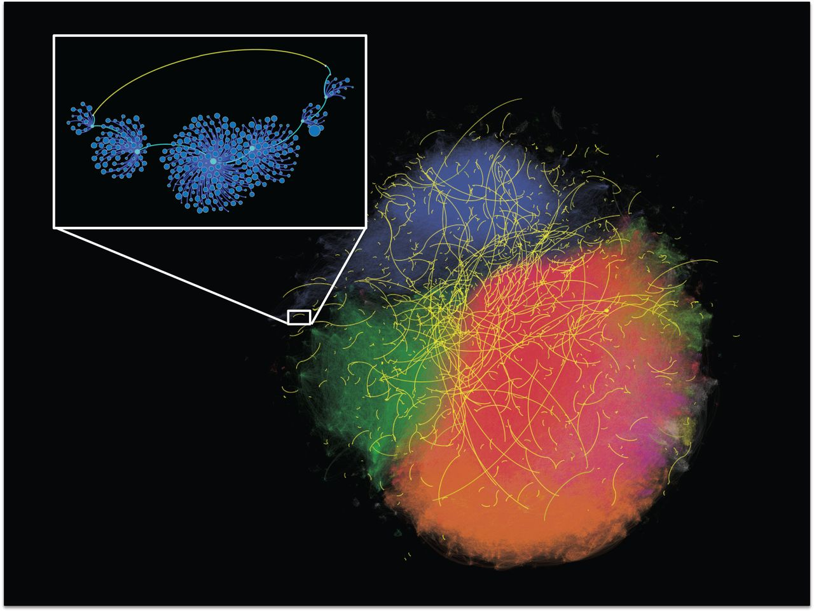

<!-- **Note: This is the website for the Fall 2023 offering. It will be updated for Fall 2024.** -->

{:.image-caption}
Network wormholes in Singapore’s Twitter network, from [Park et al, Science 2018](https://www.science.org/doi/full/10.1126/science.aau9735).
"Each dot represents an individual, and each edge represents a bidirected @mention. Nodes and edges are colored according to membership in distinct network communities. A sample of network wormholes (with range six or above and above-median tie strength) is shown in yellow. The inset highlights a single wormhole of range eight, i.e., the second-shortest path between the yellow nodes requires traversing eight intermediary ties (blue edges). The sizes of the nodes in the inset are proportional to the number of network neighbors."

### Overview

Why does Linux and the broader open-source ecosystem thrive despite weak economic incentives? Why do complex software systems sometimes fail despite being well-engineered? What makes a social media recommendation algorithm so effective and so toxic at the same time? Why do YouTube mega-influencers with tens of millions of subscribers exist, yet each of us can only recognize a handful at best? How do echo chambers and polarization emerge in social media platforms? How can you land your dream jobs? How does mass adoption of technological innovations happen? Underlying these seemingly unrelated questions is the powerful influence of social networks, the collection of on- and offline connections and dependencies that people and systems form with one another, often unknowingly. 

This course offers an introduction to the study of social networks and builds the skills needed to answer these wide range of questions by interweaving two threads. First, we introduce network science concepts and their mathematical and graph theoretical foundations, to give rigorous definitions to fuzzy words we use to describe the social world, such as "status" and "social group." Second, we apply these network concepts hands-on, to statistically model and study a wide range of puzzling online social phenomena in real-world networks.

After completing this course, you will be able to:

- construct an adequate social network representation of a given social domain
- proficiently analyze network data, and
- interpret the results with socially meaningful insights

### Coordinates
- Lectures: Tuesdays & Thursdays 2:00-3:20pm, Eastern Time, in [PH A18B](https://map.concept3d.com/?id=192#!ct/19362,7382,1568,0,7308?m/72750)
- Assignments, private announcements, reading materials: [Canvas](https://canvas.cmu.edu/courses/43625)
- Slides: this website
- Instructors: [Patrick Park](https://patpark.org) & [Bogdan Vasilescu](https://bvasiles.github.io)
- Teaching assistant: [Meryl Ye](https://merylye.github.io)

### Course Syllabus and Policies
The [syllabus](https://docs.google.com/document/d/1tpbfIJF3qw3Js54rgTto5x5g7cVg7NxWcHtPI4gELHc/edit?usp=sharing) covers course overview and objectives, evaluation, 
time management, late work policy, and collaboration policy.

<!-- ### Learning Goals
The [learning goals](learning-goals.md) describe what I want students to know 
or be able to do by the end of the semester. 
I evaluate whether learning goals have been achieved through assignments, 
written project reports, and in-class presentations. -->

### Schedule

Below is a preliminary schedule for Fall 2024. The schedule is subject to change and will be updated as the semester progresses. For previous schedules, see [Fall 2023](fall2023/).

| Date        		| Topic 	| Notes | Song of the Day
| :------------- 	|:--------|:-------- |:--------|
Tue, Aug 27 | Introduction | [slides](slides/w1_1_introduction.pdf) <!-- • [video]() -->
Thu, Aug 29 | Intro to graph theory | [slides](slides/w1_2_graph_theory.pdf) | [Connected](https://www.youtube.com/watch?v=aatK_l9Yuyk) (Stereo MCs)
Tue, Sep 3 | Random networks | [slides](slides/w2_1_random_networks.pdf) | [One](https://www.youtube.com/watch?v=ftjEcrrf7r0) (U2)
Thu, Sep 5 | Edges vs social ties | [slides](slides/w2_2_edge_vs_social_ties.pdf) | [In My Life](https://www.youtube.com/watch?v=ZqpysaAo4BQ) (The Beatles)
Tue, Sep 10 | Triads and structural balance | [slides](slides/w3_1_triads_and_structural_balance.pdf) | [You Belong With Me](https://www.youtube.com/watch?v=vwp8Ur6tO-8) (Taylor Swift)
Thu, Sep 12 | From social processes to graphs | [slides](slides/w3_2_graph_theoretic_signatures_of_social_processes.pdf) | [We Are Never Ever Getting Back Together](https://www.youtube.com/watch?v=zJFcr1KyFqE) (Taylor Swift)
Tue, Sep 17 | Homophily and degree correlation (part 1) | [slides](slides/w4_1_homophily_and_degree_correlation.pdf) | [Birds of a Feather](https://www.youtube.com/watch?v=d5gf9dXbPi0) (Billie Eilish)
Thu, Sep 19 | Homophily and degree correlation (part 2) | [slides](slides/w4_2_homophily_and_degree_correlation_pt2.pdf) | [Cowboy Like Me](https://www.youtube.com/watch?v=YPlNBb6I8qU) (Taylor Swift)
Tue, Sep 24 | Power and centrality in social networks | [slides](slides/w5_1_power_and_centrality_in_social_networks.pdf) | [Everybody Wants to Rule the World](https://www.youtube.com/watch?v=Qs-8xYwYJAQ) (Tears for Fears)
Thu, Sep 26 | Power and centrality in social exchange | [slides](slides/w5_2_power_and_centrality_in_exchange.pdf) | [No Scrubs](https://www.youtube.com/watch?v=18SwG-kep7s) (TLC)
Tue, Oct 1 | Detecting communities | [slides](slides/w6_1_communities.pdf) | [We Are Family](https://www.youtube.com/watch?v=uyGY2NfYpeE) (Sister Sledge)
Thu, Oct 3 | Structural equivalence | [slides](slides/w6_2_structural_equivalence.pdf) | [Where Do You Belong?](https://www.youtube.com/watch?v=QrHBTdAffmk) (Mean Girls the Musical)
Tue, Oct 8 | Affiliations and overlapping subgroups | [slides](slides/w7_1_affiliations_and_overlapping_subgroups.pdf) | [With a Little Help From My Friends](https://www.youtube.com/watch?v=0C58ttB2-Qg) (The Beatles)
Thu, Oct 10 | Midterm exam | 
~~Tue, Oct 15~~ | ~~Fall break, no class~~ |
~~Thu, Oct 17~~ | ~~Fall break, no class~~ |
Tue, Oct 22 | Network Analysis of Open Source Software | [slides](slides/w9_1_network_analysis_of_open_source_software.pdf) |
Thu, Oct 24 | Visualizing network data | [slides](slides/w9_2_network_visualization.pdf) |
Tue, Oct 29 | Scale-free networks | [slides](slides/w10_1_scale_free_networks.pdf) | [All Star](https://www.youtube.com/watch?v=aT5JaB5agSE) (Smashmouth)
Thu, Oct 31 | Network inequality | [slides](slides/w10_2_network_inequality.pdf)  | [God Bless the Child](https://www.youtube.com/watch?v=mp349H8G0XQ) (Billie Holiday)
~~Tue, Nov 5~~ | ~~Democracy Day, no class~~ |
Thu, Nov 7 | Small-world networks | [slides](slides/w11_2_small_world_networks.pdf) | [It's a Small World](https://www.youtube.com/watch?v=PxRW-duSCLA) (Disney)
Tue, Nov 12 | Social Capital (part 1) | [slides](slides/w12_1_bridging_social_capital.pdf) | [I Heard It Through the Grapevine](https://www.youtube.com/watch?v=VWG3npfEoHo) (Marvin Gaye)
Thu, Nov 14 | Social Capital (part 2) | [slides](slides/w12_2_bonding_social_capital.pdf) | [Bad Blood](https://www.youtube.com/watch?v=lUvBk4owRNU) (Taylor Swift)
Tue, Nov 19 | Diffusion and contagion | [slides](slides/w13_1_Diffusion_Contagion.pdf) | [Word of Mouth](https://www.youtube.com/watch?v=7jbSwMU7H0w) (Mike + The Mechanics)
Thu, Nov 21 | Ethical issues | [slides](slides/w13_2_ethics_in_social_network_research.pdf) | [Royals](https://www.youtube.com/watch?v=ZN0CEkJ_ZtI) (Lorde)
Tue, Nov 26 | Exemplary studies | [slides](slides/w14_1_exemplary_studies.pdf) | [The Man](https://www.youtube.com/watch?v=tbEekLA7J3Y) (Taylor Swift)
~~Thu, Nov 28~~ | ~~Thanksgiving, no class~~ |
Tue, Dec 3 | Guest lecture: Kathleen Carley | [slides](slides/carley_lecture.pdf) | 
Thu, Dec 5 | Final Project Presentations | | 

